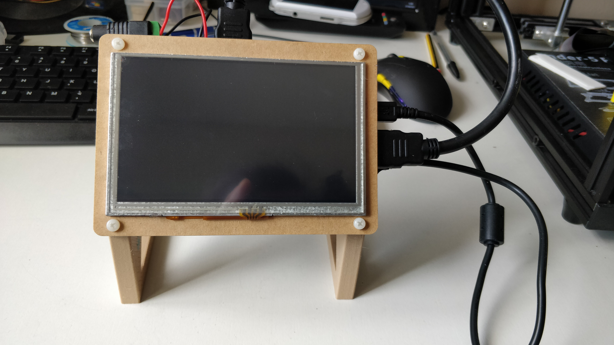
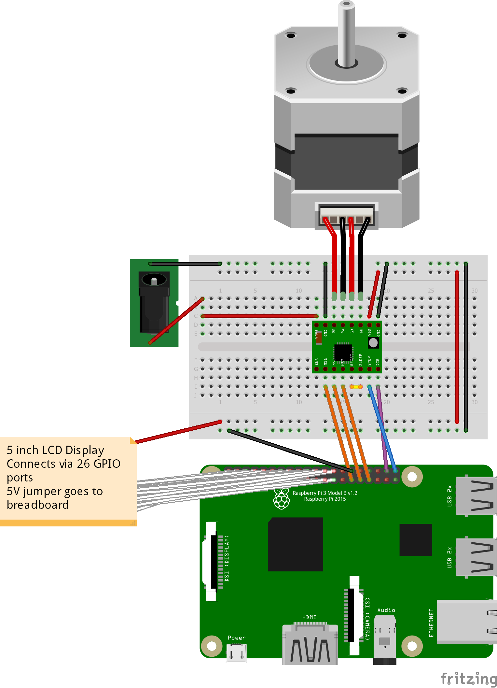
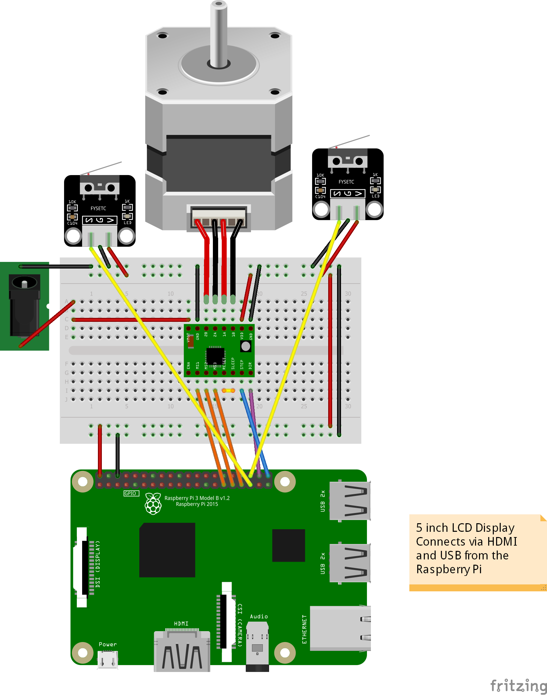
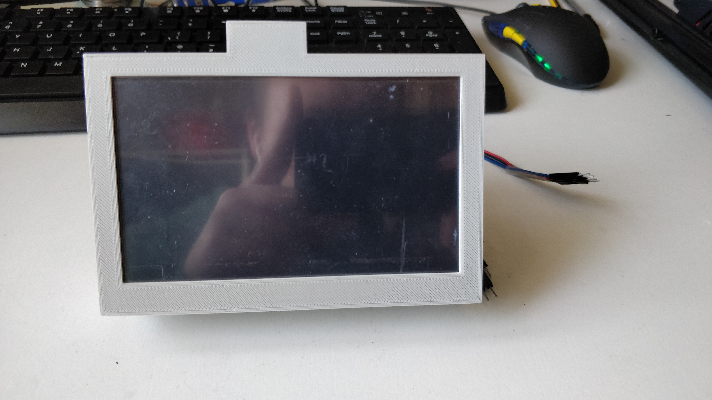
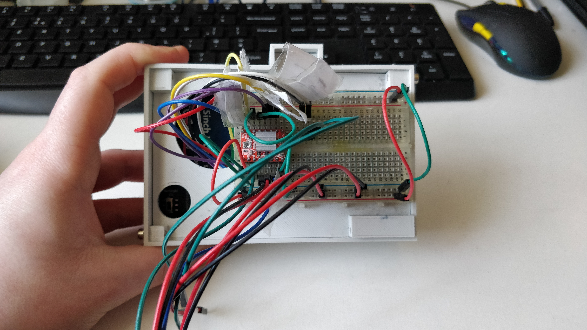
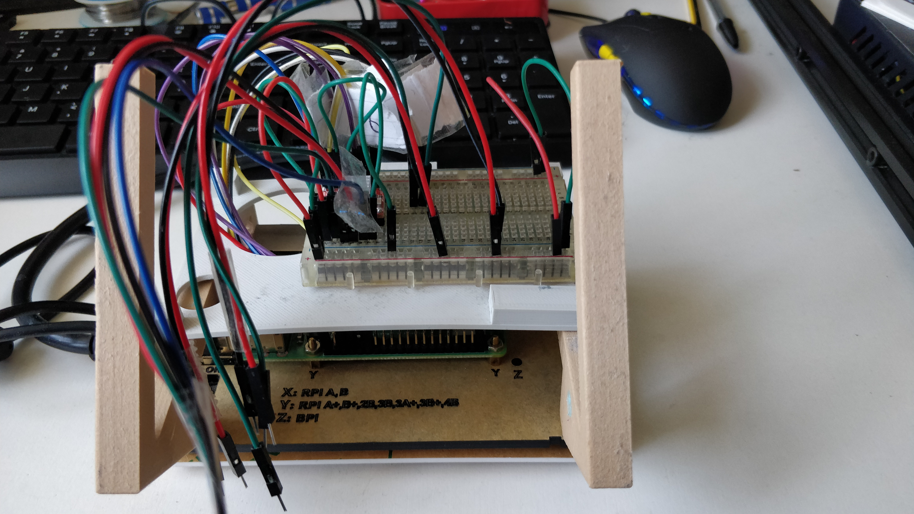
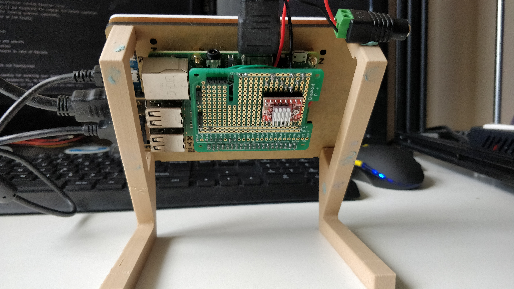

# Electronics for Syringe Pumps v1 and v2

To operate the pumps we require the following pieces of equipment:

* Microcontroller - Handles operation logic
* Motor Driver - To control the motor and talk to the microcontroller
* LCD Screen - Provides the User Interface and input
* Power Supply - 12V at 2A to run the motor and 5V at 3A for the microcontroller

For each of these I have chosen:

* Raspberry Pi

  - Powerful microcontroller running Raspbian Linux
  - Has built in Wi-Fi and Bluetooth for updates and remote operation
  - 40 GPIO pins for running external components
  - HDMI output for an LCD display

* A4988 Motor Driver

  - Easy to setup and operate
  - Cheap and powerful
  - Easily replaceable in case of failure

* Waveshare 5 inch LCD Touchscreen

  - Touchscreen capable for handling user input
  - Powered by the Raspberry Pi, no need for an external power source
  - Connects through HDMI and USB, doesn't use any GPIO pins

* 12V 2A Barrel Jack - Powers the Motor

* 5V 3A Micro USB - Extra current required to run Raspberry Pi and LCD screen

---
## Schematic for Syringe Pump v1

---
## Schematic for Syringe Pump v2

---
## Breadboard for v1 Setup

---
## Breadboard for v2 Setup

---
## Final Electronics Setup for v2

---
## Notes on Future Upgrades

* Design a PCB based on the breakout board
  - Will mean less soldering is required to build a complete system
  - Can allow for multiple motor drivers and limit switch headers to be installed
* Find a cheaper touchscreen alternative
  - One that makes use of the RPis onboard ribbon cable
* Combined Power Supply
  - 12V 2A for the Motor PSU
  - 5V 3A for the RPi PSU
  - Current system requires 2 power slots where I'd rather have 1
