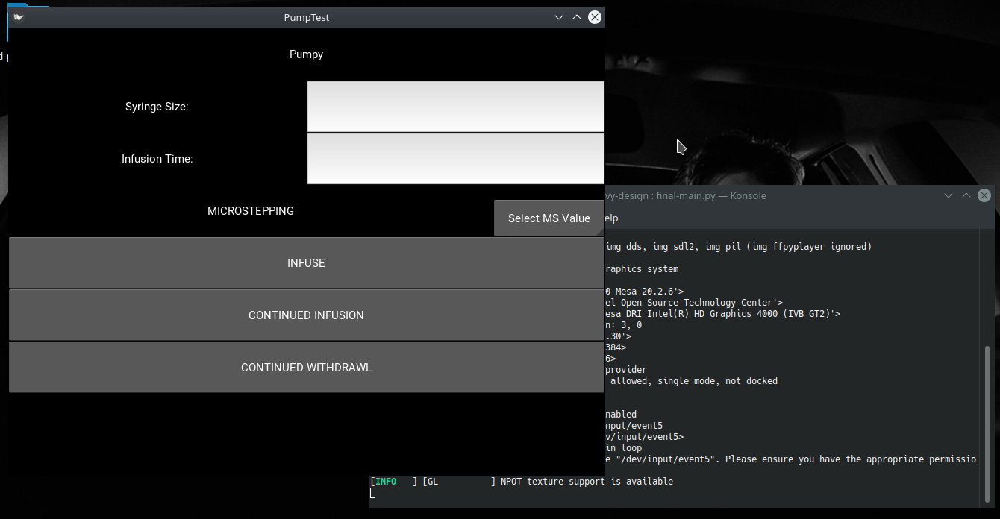

# Building a GUI for Pumpy

Now that we have:

* Upgraded version of the Pump hardware
* Electronics setup with microcontroller and touchscreen interface
* Testing suite for Pump operation
  - Including an object for handling multiple pump operations

We can create a graphical user interface (GUI) that provides all the required functionality
for our pump in a simple design that can be replicated for our Android application.

We've chosen to use Python as our programming language for its compatibility with the GPIO ports
on the Raspberry Pi. It also has a large number of GUI libraries we can make use of such as:

* Kivy
* Tkinter
* PyQt
* wxPython

Here I will discuss the 2 libraries I worked with: Kivy and PyQt5 and why I chose to use
PyQt5 for the final GUI system.

---
## Kivy

Documentation for the code can be found [here](./kivy-design/README.md)

There are 2 main ways to design a GUI using Kivy:

* Write a `.kv` file for the UI elements and a `.py` file for the functionality
* Combine UI elements and functionality into a single `.py` file

Using a .kv file requires writing the UI structure in the Kv design language - a tool I
found to be unintuitive. It also allows for the separation of functionality and UI so that
the user can produce easy to read code.

Combining UI elements and functionality into a single file negates this benefit, allowing the
user to write code similar to the JSwing library for Java.

The main benefit of using Kivy is its ability to compile code into an executable Android application
for mobile devices. Doing this preserves the UI design across multiple platforms for consistency and
ease of use.

Unfortunately this also limits the functionality of the mobile application to simple I/O and as such would
be unable to operate the Syringe Pump. Due to this and the unintuitive nature of the Kv design language
I chose to build the application with PyQt5.

---
## PyQt5

Documentation for the code can be found [here](./qt-design/README.md)

The Qt toolkit is a set of cross-platform libraries for software and UI design. The Python Qt library has a
number of tools that make designing UIs easier. For our purposes we use the Qt Designer application to create
a UI in the simplest way possible. This application generates a `.ui` file that can be imported into Python and
from there functionality can be written into the class.

This allows us the separation of UI elements and functionality that Kivy provided us with, but is much more
intuitive for designing a GUI. The Qt Designer gives you the maximum amount of control over how the GUI looks
with instant visual feedback and CSS support for styling elements.

Using this tool along with the PyQt5 library we have written a minimal GUI that is user friendly and adaptable
to mobile devices.

---
## Future Work

* Customisable syringe measurements for different syringe brands
  - Hospitals use a range of Syringe brands and my system is set for BD Plastipak syringes
  - UI would allow a choice of brands and rebuild the lookup table to reflect that
* Debugging tool for testing individual components
  - Would allow for a system where users can easily see what's wrong with their device
  - Very important for a tool designed for use by a computer layman
