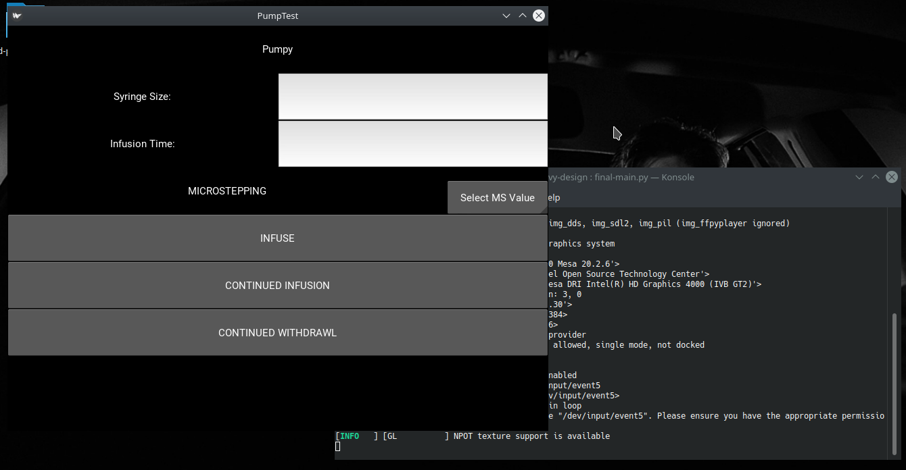

# Kivy Design



## `old_main.py`

This class was developed as a test system for trying out each of the UI elements required
for the Pumpy UI

### Functions

```
def forwards(instance)
def backwards(instance)
def release(instance)
```

Test functions to ensure that binding functions to elements works as intended

### Class

`def PumpTestApp(App)`

Main class to encapsulate all functionality and elements of the application. Subclasses the
App object from the Kivy library: `kivy.app.App`

### Methods

`def build(self)`

Overridden method inside of `PumpTestApp` that sets up 3 layouts:

* `main_layout`
* `middle_layout`
* `middle_left_layout`

Labels and buttons are setup inside of these layouts. `on_press` and `on_release` variables
for each button are set to the functions defined above. This method then returns `main_layout`
which is executed in the main function of the program.

### Main Method

```
if __name__ == "__main__"
    PumpTestApp().run()
```

The `run()` method of the App class will take the return value of the `build()` method and run
the layout through its graphics processing engine in order to generate the GUI we've described.

---
## `final-main.py`

Built to try a different layout style and build in the necessary features for the pump to be
operated

### Functions

```
def forwards(instance)
def backwards(instance)
def release(instance)
```

Test functions to be bound to buttons on the GUI

### Class

`def PumpTestApp(App)`

Main class that subclasses App and contains the methods for running the UI

### Variables

```
size_input = ObjectProperty()
time_input = ObjectProperty()
ms_button = ObjectProperty()
```

Objects to store widgets (UI elements) so we can call on them for the given user input or choices
for use by Pumpy.

### Methods

`def infuse(self, instance)`

Takes the given values for syringe size, time and microstep and displays them to the screen - these
values can easily be sent to Pumpy for infusion

`def show_spinner_value(self, spinner, text)`

Method for getting the value of a given spinner - a spinner is a clickable widget that allows the user
to input a number without typing

`def build(self)`

Sets up 4 layouts along with inputs for syringe size, microstepping and time input. Then buttons are set up
for infusion, continuous withdrawal and continuous infusion. The functions and methods above are bound to these
buttons and the UI returns the layout `main_layout`

### Main Method

```
if __name__ == "__main__":
    PumpTestApp().run()
```

The `run()` method of the App class will take the return value of the `build()` method and run
the layout through its graphics processing engine in order to generate the GUI we've described.
