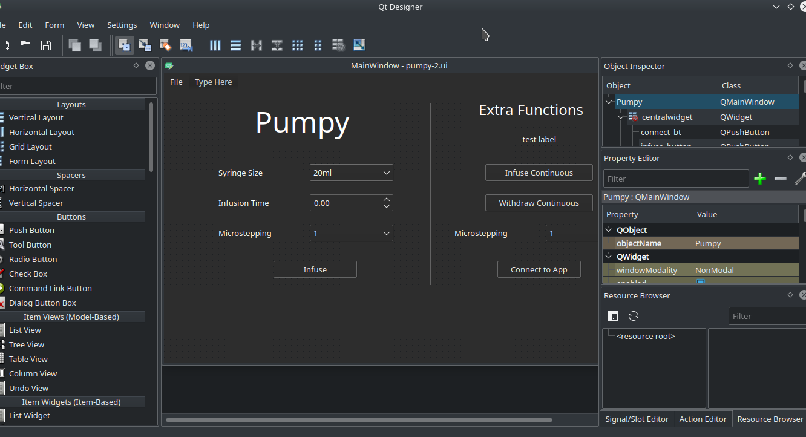
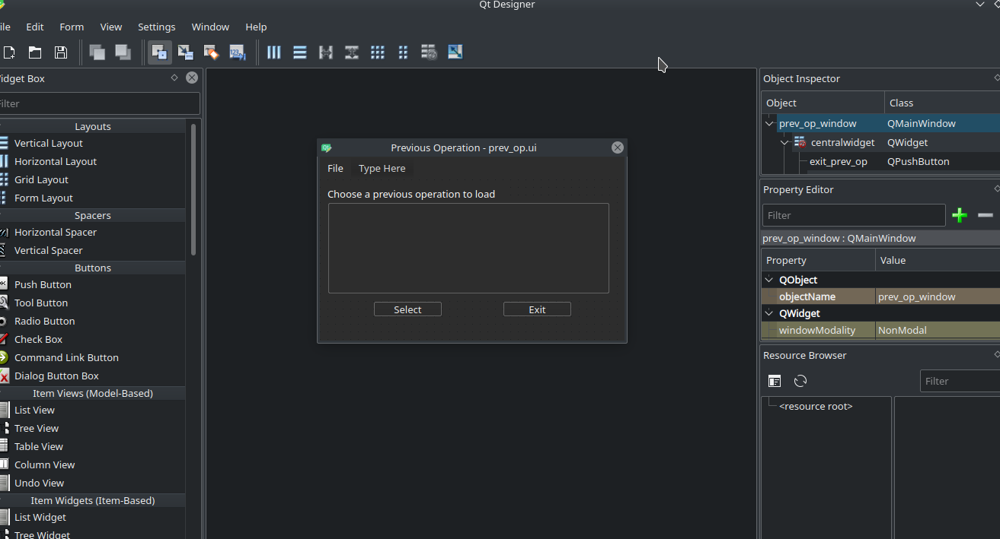

# PyQt Design

## `ui/pumpy-2.ui`

This is an image of the UI designed in Qt Designer - this is the second iteration I
wrote for this UI. Using stylesheets with Qt Designer brings some issues with elements
in the layout hierarchy so where the background should be grey it can show up white.

## `ui/prev_op.ui`

Same issues as above were present, but this menu option is much simpler.

## `main.py`

### Classes

`class Pumpy_Ui(QtWidgets.QMainWindow)`

Handles importing the UI file, encapsulates the functions that the UI must perform and
assigns them to the correct buttons and text input elements.

`class PreviousOperations_Ui(QtWidgets.QMainWindow)`

Performs the same functions as above but for the Previous Operations screen

### Methods

For `Pumpy_Ui()`:
---

`def __init__(self)`

Imports the UI file `pumpy-2.ui`, sets up the Pumpy instance, connects functions to
appropriate buttons, sets up previous operations list and displays the window

`def infuse_button_pressed(self)`

Takes the user input values and calls `self.pump.pump()` with those values as
arguments - work is being done on a threaded alternative so that the GUI can
still be used while the pump is running

`def infuse_continuous_pressed(self):`

Takes the user defined micro-stepping value and runs the `self.pump.continuous()`
method for that value with `Pumpy.INFUSE` as the direction argument

`def withdraw_continuous_pressed(self)`

Takes the user defined micro-stepping value and runs the `self.pump.continuous()`
method for that value with `Pumpy.WITHDRAW` as the direction argument

`def open_prev_ops(self):`

Initialises the Previous Operations UI class and displays it to the screen

`def load_prev_ops(self, operation)`

When a previous operation is loaded in from the Previous Operations UI, this method
is called to setup the input boxes with the chosen operation

`def exit_ui(self)`

Closes the program by calling `sys.exit(0)`

For `PreviousOperations_Ui()`
---

`def __init__(self, parent)`

Load the Previous Operations UI file, bind functions to buttons and populate the
list of previous operations

`def load_operation(self)`

Gets the selected operation as a list and sends it to the `load_prev_ops(self, operation)`
method in `Pumpy_Ui()`

`def exit_ui(self)`

Closes the window by calling `self.close()`
