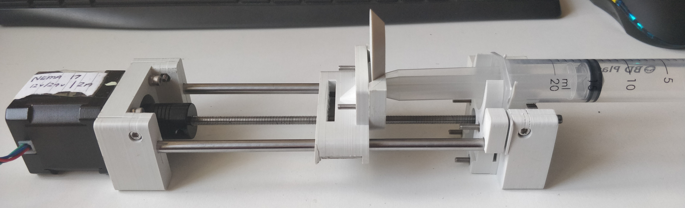
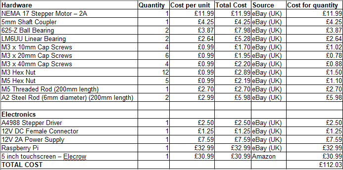

# Syringe Pump v1

---
## Introduction
The first iteration of the Pumpy Syringe Pump is based on the Open Source Syringe Pump [1] from notable Open Source
Hardware Academic Engineer Joshua Pearce. The paper defines a proof of concept for a linear actuator with an attachment for a syringe, capable of infusing liquid from the syringe with a high degree of accuracy. This has practical applications
in many areas including bespoke research laboratories and medical facilities.

---
## Build Information
The pump itself is built using 3D printed parts [(STL files located here)](https://cseegit.essex.ac.uk/ce301_2020/ce301_woolsey_daniel/-/tree/master/syringe-pump-v1/stl-files) and basic building materials shown below in the bill of materials.

A [build guide](build-guide.md) is included - a modified version of the Open Source Syringe Pump guide - to provide a
step by step process on putting the pump together and testing it with the Raspberry Pi computer.

For the 3D printed parts I used an Ender 5 Pro with generic brand PLA as the plastic.

# Modifications
I made a number of modifications to the Open Source Syringe Pump in order to fix some issues I found during the build
and testing process. These are detailed [here](./modifications-from-build.md). Modified 3D printed parts are labelled as such in the [stl-files](./stl-files) folder and the build
guide makes use of these modifications.

## References
[[1] Open Source Syringe Pump - Wijnen et al.](https://doi.org/10.1371/journal.pone.0107216)
[[2] Syringe Drivers - Marie Curie](https://www.mariecurie.org.uk/professionals/palliative-care-knowledge-zone/symptom-control/syringe-drivers)
