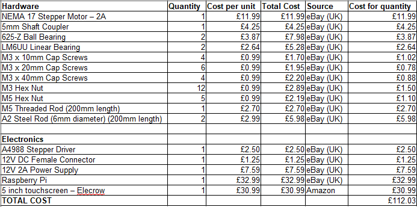

# Syringe Pump v1 - Based on the OSSP

---
## Build Guide

The original build guide found [here](https://www.appropedia.org/Open-source_syringe_pump#How_to_Build_an_Open-source_Syringe_Pump) isn't very clear on certain instructions, so I improved upon them to make the build process
easier for anyone who wants to replicate the design. The printable STL files also include my modified versions of the original carriage and syringe holders which makes building and operating the pump easier.

---
## Parts List

### Tools

* 2mm Allen Key
* 3mm Allen Key

### 3D Printed Parts

* [Motor End](./stl-files/motor-end.stl)
* [Carriage (modified)](./stl-files/carriage-modified.stl)
* [Plunger Holder Base](./stl-files/plunger-holder-base-and-tab.stl)
* [Plunger Holder Tab](./stl-files/plunger-holder-base-and-tab.stl)
* [Idler End](./stl-files/idler-end.stl)
* [Syringe Body Holder (modified) (x2)](./stl-files/syringe-holder-modified.stl)

### Bill of Materials

### Exploded Parts View

---
## Build Steps

1. Insert 2 M3 hex nuts into the inside of the Motor End

2. Using 4 M3 x 20mm cap screws and 4 M3 hex nuts, attach the Motor End to the NEMA 17 Stepper Motor
   (NOTE: The nuts go on the inside of the Motor End for spacing and to help reduce vibrations)

3. Attach the 2 steel rods into the holes in the Motor End and secure them with 2 M3 x 10mm screws

4. Loosen the 4 screws on the coupler, insert the threaded rod half way into the coupler and tighten
   the 2 coupler screws on the threaded rods side

5. Insert the coupler into the NEMA 17 motor and tighten the last 2 screws on the coupler

6. Insert the 2 linear bearings into each side of the Carriage and push an M5 hex nut into the bottom of
   the Carriage
   (NOTE: For the unmodified Carriage you will need to cut out spaces for the linear bearings)

7. Attach the Plunger Holder Base to the Carriage using 2 M3 hex nuts and 2 M3 x 20mm cap screws

8. Slide the carriage onto the threaded rod and steel rods ensuring they go through the bearings and M5 hex nut,
   twisting the coupler counter-clockwise to slide the carriage halfway down the rods

9. Twist 2 M5 hex nuts onto the threaded rod leaving a gap between them and the carriage

10. Insert 2 M3 hex nuts and the 2 ball bearings into the Idler End and slide it onto the rods

11. Twist 2 M5 hex nuts onto the end of the threaded rod up to the ball bearing on the outside of the
    Idler End and twist the 2 M5 hex nuts from step 9 up to the ball bearing on the other side

12. Tighten the steel rods to the Idler End using 2 M3 x 10mm cap screws

13. Line up the 2 Syringe Body Holders from the Idler End and place the syringe between them with the
    bumped side facing towards the Motor End

14. Using 4 M3 hex nuts on the Body Holder closest to the carriage and 4 M3 x 40mm cap screws on the Idler
    End screw the Body Holders together onto the Idler End, ensuring the Syringe Body is tight in the
    Plunger Holder with the tab and between the 2 Body Holders

