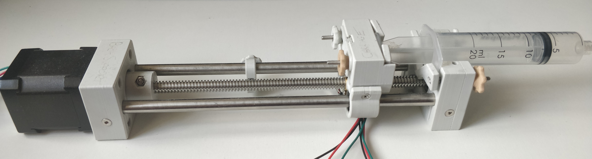

# Syringe Pump v2

## Introduction

The Syringe Pump v2 is an overhaul of the Open Source Syringe Pump used in Syringe Pump v1 and incorporates
design elements from Andrey Samohkhins Syringe Pump design [1]. This design brings in 2 extra features:

* Custom hand knobs for quick and easy syringe switching
* Limit Switches on the carriage to prevent over actuation
* Adjustable Limit Stoppers for easy withdrawl and setup of syringe

## Build Information

The model files for the 3D printed parts can be found [here](./stl-files) and were printed using an Ender 5 Pro printer. The bill of materials is included below:

There are a number of electronics requirements for building this pump:

* De-soldering Limit Switches from their breakout boards
* Cutting and soldering wires to each terminal of the Limit Switches

This is easily done with a soldering iron, wires, some solder and a bit of patience.

A [build guide](./build-guide.md) is included to account for modifications to the build guide initially written
for this style of pump. For the full electronics wiring diagrams please refer to the [electronics page here](././electronics/README.md).

## Future Modifications

* More robust hand knobs with locking systems for the bolts
  - Currently we're super gluing the bolts into the hand knobs, but it could be better
* Attachments on the side of the Motor and Idler ends to link with another Pump
  - Also requires extension of the electronics, Pump UI and mobile app

## References

[1] https://www.thingiverse.com/thing:4194094
