# Syringe Pump v2

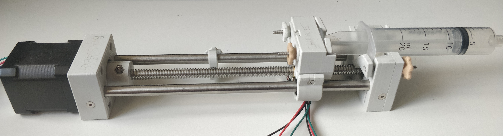

---
## Parts List

### Tools

* 2mm Allen Key
* 3mm Allen Key
* Phillips Head Screwdriver
* Soldering Iron
* Solder
* Wires
* Super Glue (optional)

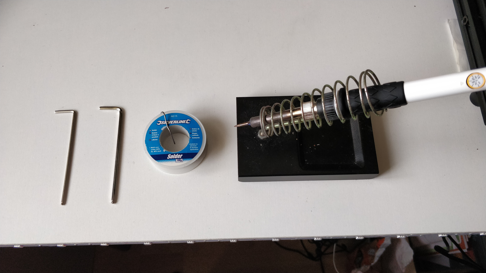

### 3D Printed Parts

* [Back Support](./stl-files/backSupport.stl)
* [Coupling](./stl-files/coupling.stl)
* [Carriage](./stl-files/carriage.stl)
* [Limit Stop (x2)](./stl-files/limitStop.stl)
* [Front Support](./stl-files/frontSupport.stl)
* [Wire Holder](./stl-files/wireHolder.stl)
* [Plunger Holders](./stl-files/plungerHolders.stl)
* [Side Syringe Holder](./stl-files/sideSyringeHolder.stl)
* [Slider](./stl-files/slider.stl)
* [7mm Hand Knobs (x2)](./stl-files/handKnob7mm.stl)
* [8mm Hand Knobs (x2)](./stl-files/handKnob8mm.stl)
* [9mm Hand Knobs (x2)](./stl-files/handKnob9mm.stl)

### Bill of Materials Spreadsheet

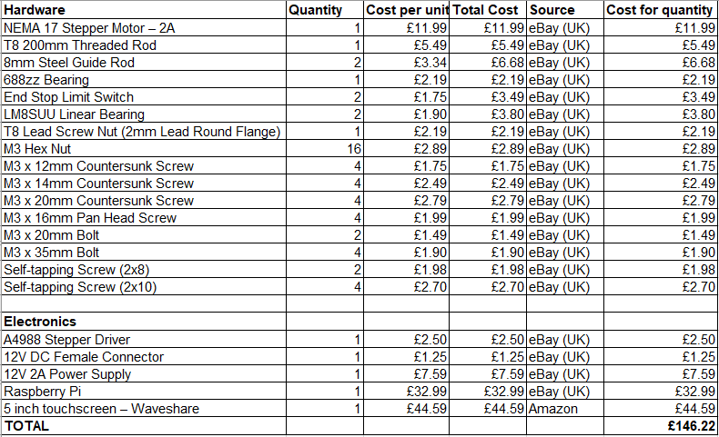

### Exploded Parts View

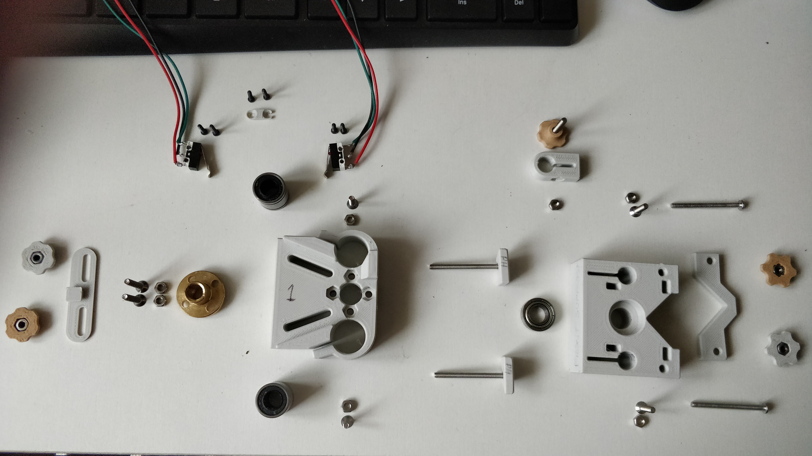
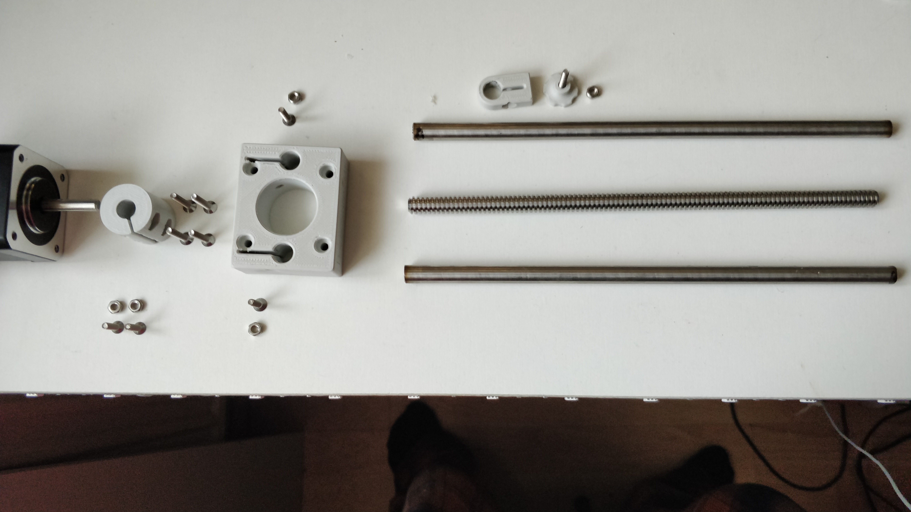

---
## Build Guide

1. Using 2 M3 x 12mm Countersunk Screws and 2 M3 Hex Nuts, attach the coupling to the motor and the
   threaded rod

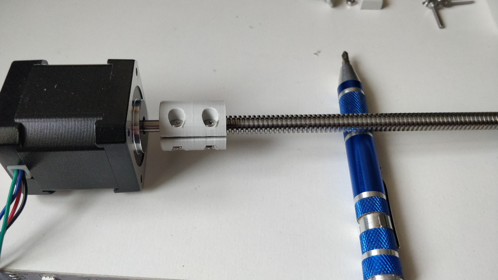

2. Using 4 M3 x 20mm Countersunk Screws and 2 M3 Hex Nuts, insert the nuts into the Back Support, slide it through the
   threaded rod and screw it into the motor

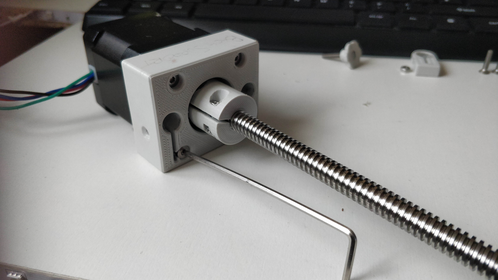

3. Using 2 M3 x 14mm Countersunk Screws, insert the 2 steel rods into the holes and tighten them in with
   the screws

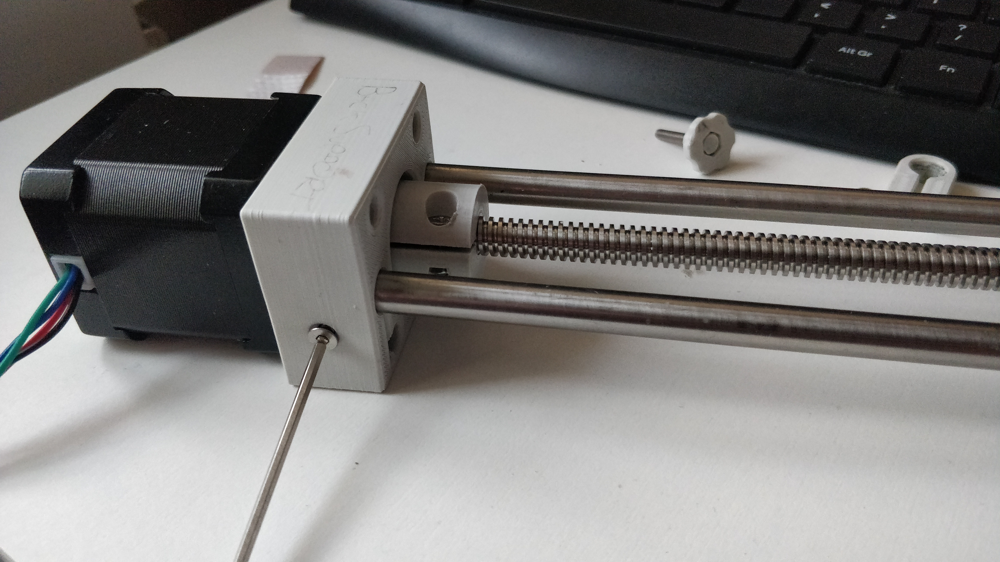

4. Assemble the 2 Limit Stops using 2 7mm Hand Knobs, 2 M3 Nuts and 2 M3 x 20mm Bolts - to make this easier
   you can super glue the bolt head into the Hand Knob.

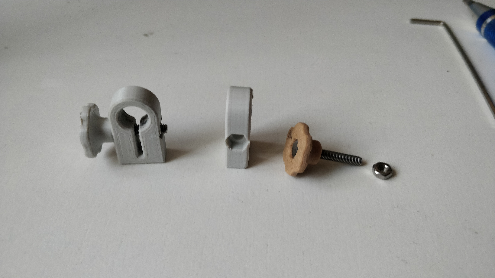

5. Take the Carriage and insert the 2 linear bearings, then use 2 M3 Hex Nuts and 2 M3 x 12mm Countersunk Screws
   on the side of the Carriage to hold the bearings inside

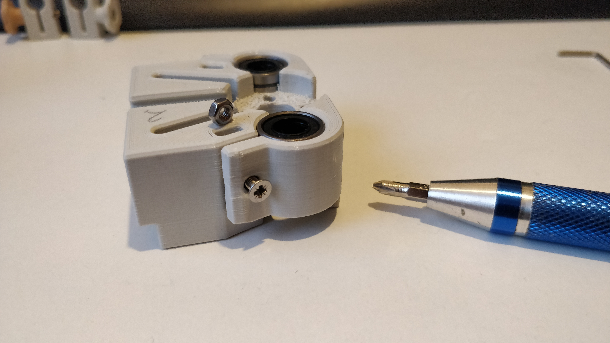

6. Using 2 M3 x 16mm Pan Head Screws and 2 M3 Hex Nuts, attach the T8 Lead Screw Nut into the Carriage and tighten
   the top and bottom holes

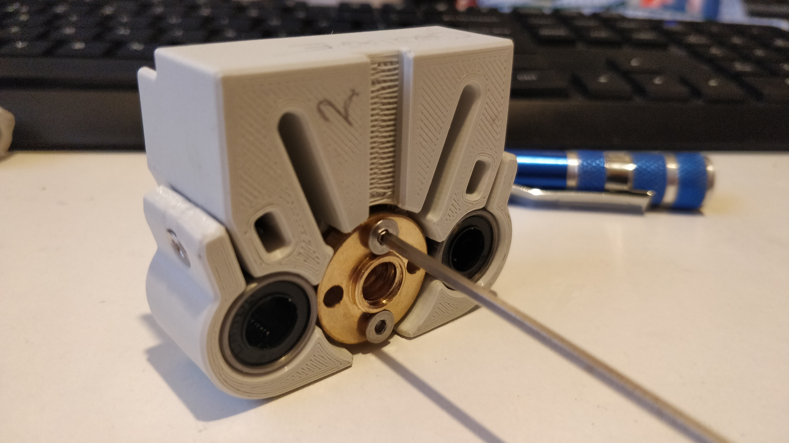

7. De-solder the Limit Switches from their breakout boards, cut 6 equal lengths of wire and solder them to the 6
   terminals of the limit switches

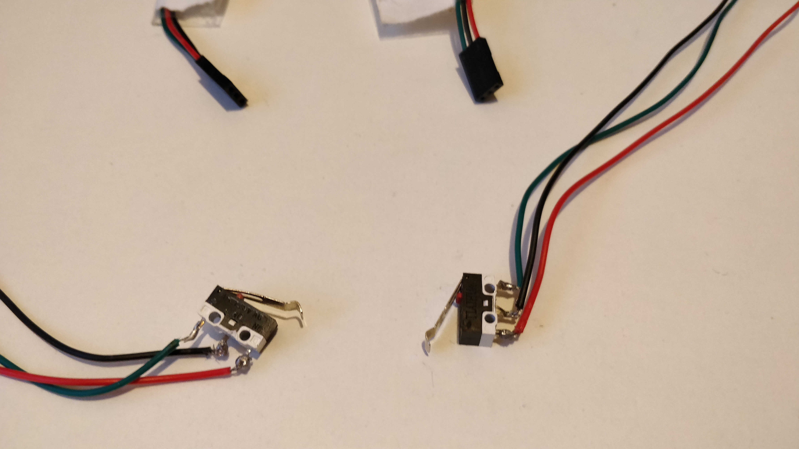

8. Using 4 2x10 Self-tapping screws, attach the Limit Switches to the underside of the carriage, then feed the wires
   along the base and secure them with the Wire Holder and 2 2x8 Self-tapping screws

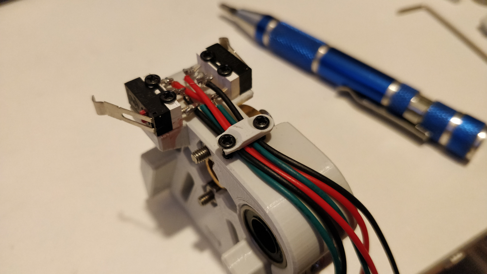

9. Slide 2 M3 x 35mm Bolts into the Plunger Holders, insert 2 M3 Hex Nuts into the 2 8mm Hand Knobs, push the Slider
   into the Carriage and insert the Plunger Holders into the gaps on the slider from the other side, tightening them with the Hand Knobs onto the Slider side

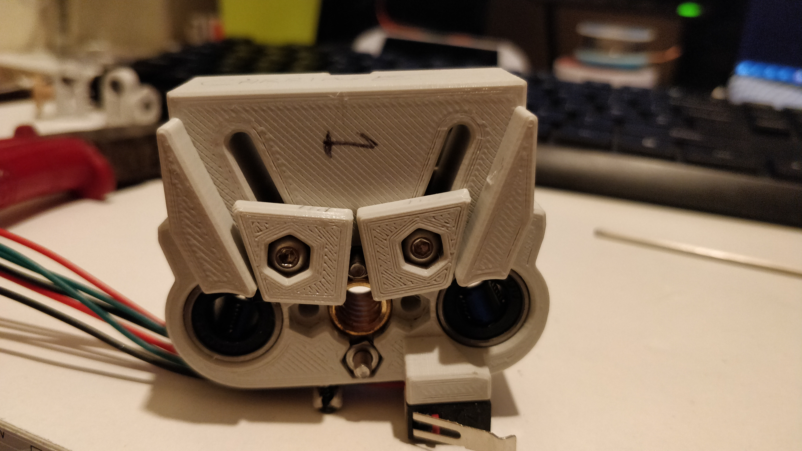
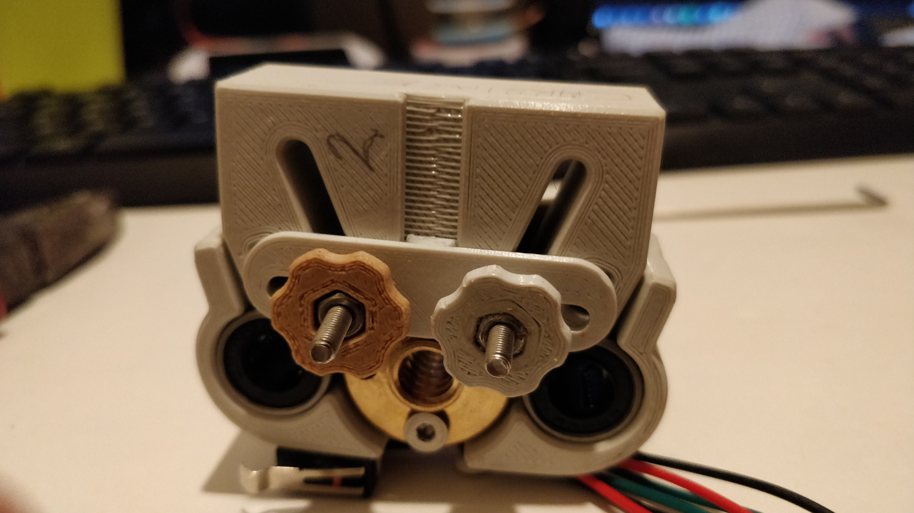

10. Slide the first Limit Stop onto the left steel rod, then push the Carriage onto the threaded rod (Plunger Holders
    facing away from the motor) and twist the coupling counter-clockwise to bring the carriage along the rod. Then slide
    the other Limit Stop onto the left steel rod

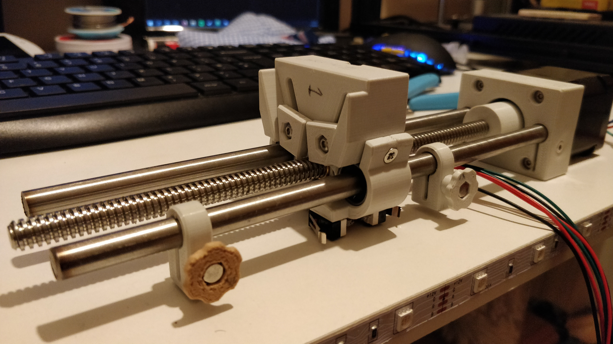

11. Push the 688ZZ bearing into the Front Support, using 2 M3 x 35mm Bolts attach the Side Syringe Holder to the side of
    the Front Support where the bearing is and use 2 9mm Hand Knobs and 2 M3 Hex Nuts on the other side of the bolts to
    adjust the tightness of the Side Syringe Holder

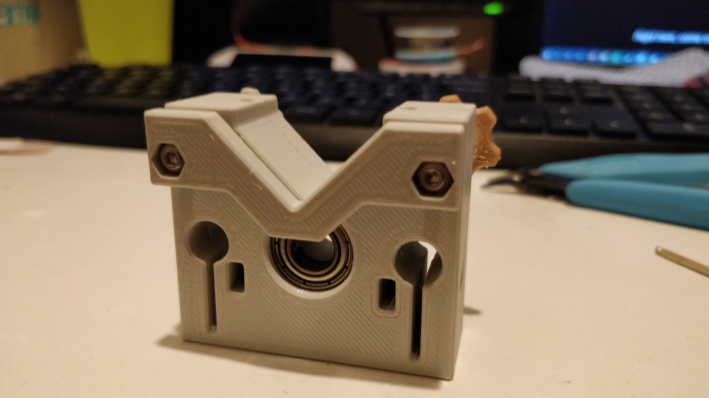
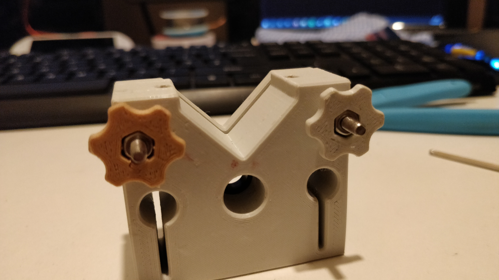

12. Slide 2 M3 Hex Nuts into the Front Support, slide it onto the end of the rods and tighten it using 2 M3 x 14mm
    Countersunk Screws

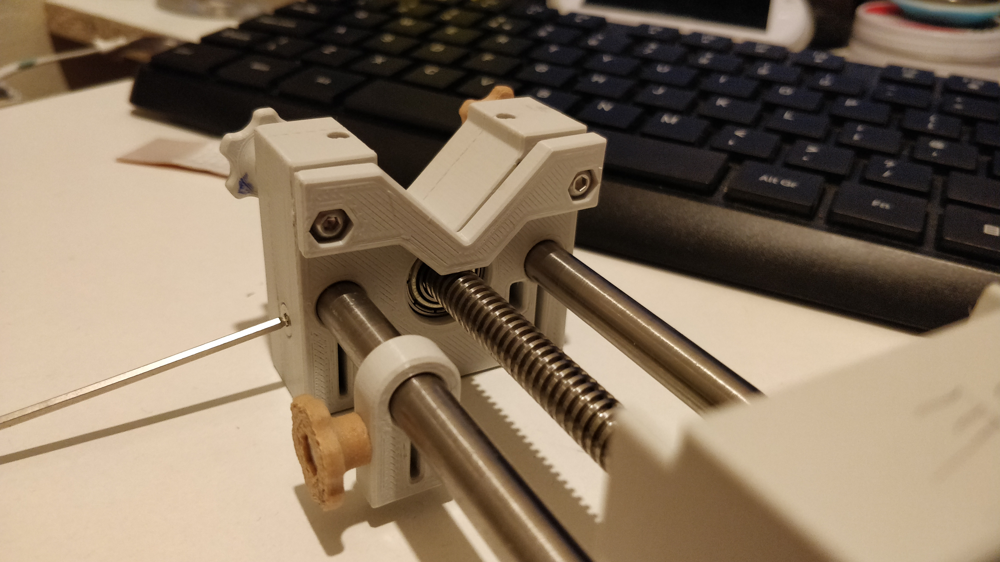
