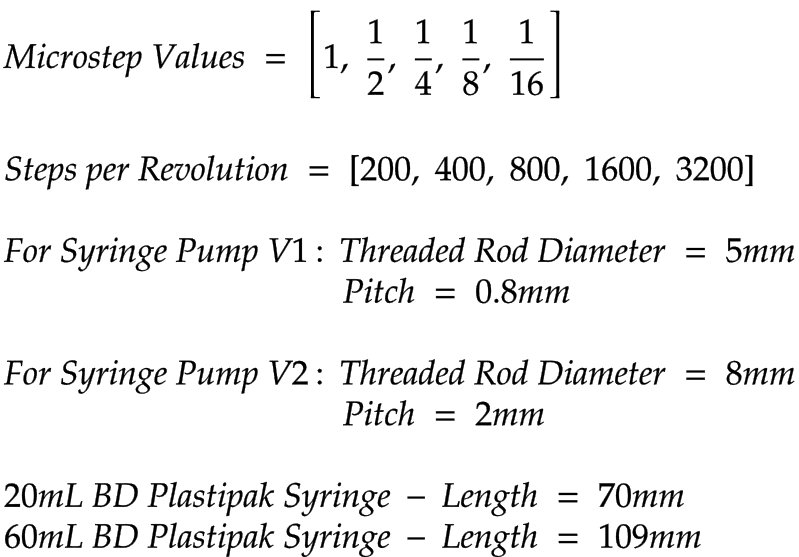
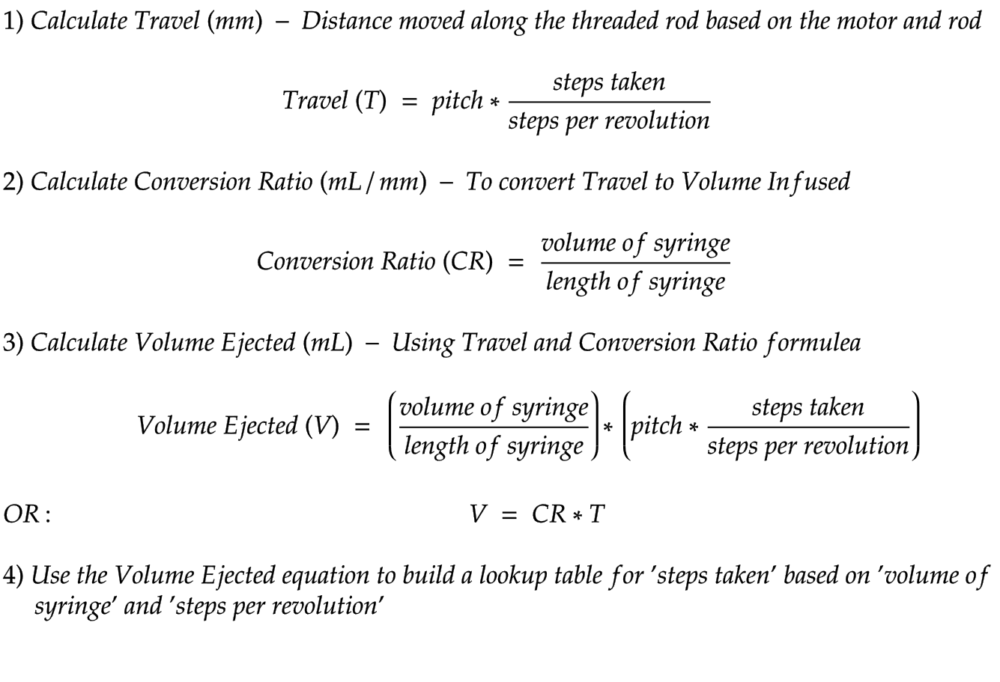

# Syringe Pump Maths Calculations

## Variables

## Formulea

## Syringe Pump v1 Lookup Table

| Steps per Revolution | Microstepping Value | 20mL    | 60mL    |
|----------------------|---------------------|---------|---------|
| 200                  | 1                   | 17,500  | 27,250  |
| 400                  | 1/2                 | 35,000  | 54,500  |
| 800                  | 1/4                 | 70,000  | 109,000 |
| 1600                 | 1/8                 | 140,000 | 218,000 |
| 3200                 | 1/16                | 280,000 | 436,000 |

## Syringe Pump v2 Lookup Table

| Steps per Revolution | Microstepping Value | 20mL    | 60mL    |
|----------------------|---------------------|---------|---------|
| 200                  | 1                   | 7000    | 10,900  |
| 400                  | 1/2                 | 14,000  | 21,800  |
| 800                  | 1/4                 | 28,000  | 43,600  |
| 1600                 | 1/8                 | 56,000  | 87,200  |
| 3200                 | 1/16                | 112,000 | 174,400 |
